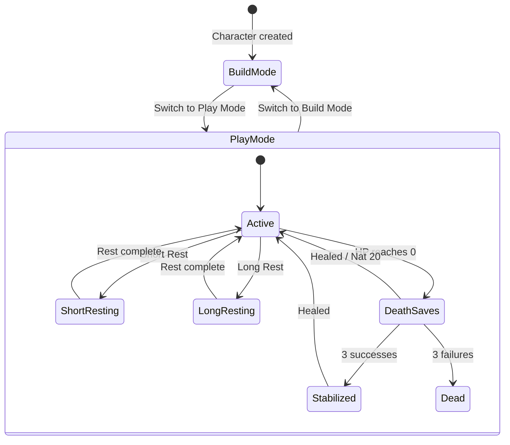

# Unit 1: Play State Engine — Business Logic Model

## State Transition Diagram



## Core Operations

### 1. Damage/Healing Pipeline

```
take-damage(state, amount):
  remaining = amount
  if temp-hp > 0:
    absorbed = min(temp-hp, remaining)
    temp-hp -= absorbed
    remaining -= absorbed
  current-hp -= remaining
  current-hp = max(0, current-hp)
  if current-hp == 0:
    activate-death-saves(state)
  return state

heal(state, amount):
  was-at-zero = (current-hp == 0)
  current-hp = min(current-hp + amount, max-hp + max-hp-modifier)
  if was-at-zero:
    reset-death-saves(state)
    remove-condition(state, :unconscious)
  return state
```

### 2. Rest Pipeline

```
short-rest(state, hit-dice-to-spend):
  for each die in hit-dice-to-spend:
    roll = roll-die(die.size) + con-modifier
    state = heal(state, max(1, roll))
    increment hit-dice-used for die.size
  reset pact-slots-used = 0
  reset resources where reset-on = :short-rest
  reset blood-curses-used
  return state

long-rest(state):
  current-hp = max-hp + max-hp-modifier
  all spell-slots-used = 0
  pact-slots-used = 0
  reset ALL resources (short-rest + long-rest types)
  recover floor(total-hit-dice / 2) hit dice (min 1)
  reset death-save-successes = 0
  reset death-save-failures = 0
  reset blood-curses-used
  return state
```

### 3. Equipment Toggle Pipeline

```
toggle-equipment(state, item-key, equip?):
  if equip?:
    add item-key to equipped-items
  else:
    remove item-key from equipped-items
  rebuilt-char = entity/build(raw-entity-with-equipment-state)
  broadcast-state-change(character-id, :equipment-changed)
  return {state with new equipped-items, rebuilt-char}
```

### 4. Crimson Rite Pipeline

```
activate-rite(state, weapon-key, rite-key):
  check: active-rites count < max-simultaneous-rites
  hp-cost = hemocraft-die-size(level)
  max-hp-modifier -= hp-cost
  if current-hp > (max-hp + max-hp-modifier):
    current-hp = max-hp + max-hp-modifier
  add {weapon-key, rite-key, damage-type, hp-cost} to active-rites
  trigger entity/build (rite adds damage modifier)
  return state

deactivate-rite(state, weapon-key):
  rite = find active-rite for weapon-key
  max-hp-modifier += rite.hp-cost
  remove rite from active-rites
  trigger entity/build
  return state
```

### 5. Death Saves Pipeline

```
record-death-save(state, roll):
  if roll == 20:  ; Natural 20
    state = heal(state, 1)  ; resets tracker via heal pipeline
  elif roll == 1:  ; Natural 1
    death-save-failures += 2
  elif roll >= 10:  ; Success
    death-save-successes += 1
  else:  ; Failure
    death-save-failures += 1
  
  if death-save-successes >= 3: stabilize(state)
  if death-save-failures >= 3: mark-dead(state)
  return state
```

### 6. Dice Rolling (Frontend Only)

```
roll-dice(notation):
  parsed = parse-notation(notation)  ; {num, sides, modifier, advantage?}
  results = for i in 1..num: random(1, sides)
  if advantage?: keep-highest(results, 1)
  elif disadvantage?: keep-lowest(results, 1)
  total = sum(kept-results) + modifier
  entry = {id, notation, dice: results, modifier, total, timestamp}
  prepend to roll-history (cap at 50)
  return entry
```

## Integration with Existing Entity Engine

The key insight: **Play state attributes feed into the entity build process as conditions.**

```
Character Build (enhanced for Play Mode):
  1. Collect modifiers from template options (existing)
  2. Inject play-state conditions:
     - equipped-items → enable/disable equipment modifiers
     - active-rites → inject rite damage modifiers
     - prepared-spells → filter spell access modifiers
  3. Topological sort + apply modifiers (existing)
  4. Built character now reflects play state
```

This means equipping a shield, activating a rite, or changing prepared spells all flow through the existing build pipeline — zero new calculation logic needed for derived stats.

## Persistence Strategy

| Data | Storage | Reason |
|------|---------|--------|
| Play state (HP, slots, resources, conditions, equipment) | Datomic (character entity) | Cross-device, real-time sync |
| Dice roll history | Frontend app-db only | Ephemeral, session-scoped |
| Play/Build mode flag | Datomic | Remembers last mode on re-open |
| Built character cache | Frontend app-db (subscription) | Recomputed on any change |
