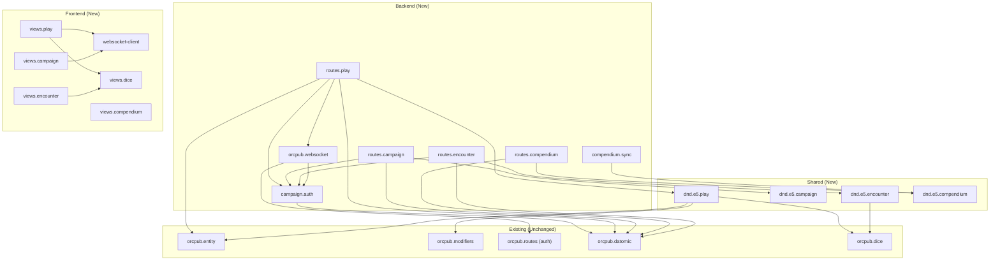

# Application Design

## Design Decisions
| Decision | Choice | Rationale |
|----------|--------|-----------|
| WebSocket | Jetty 11 native (JSR 356) | Zero new deps, already available via Pedestal 0.7 |
| Compendium storage | Same Datomic DB | Simple queries, existing infrastructure, no operational overhead |
| Play state | Same character entity (additional attributes) | One entity = one character, simple persistence |

---

## New Components

### Backend (Clojure - JVM only)

| Component | Namespace | Purpose |
|-----------|-----------|---------|
| WebSocket Handler | `orcpub.websocket` | JSR 356 WebSocket endpoint, connection management, message routing |
| Campaign Routes | `orcpub.routes.campaign` | REST API for campaign CRUD, invite codes, membership |
| Encounter Routes | `orcpub.routes.encounter` | REST API for encounter CRUD, initiative, monster HP |
| Compendium Routes | `orcpub.routes.compendium` | REST API for searching/browsing compendium content |
| Compendium Sync | `orcpub.compendium.sync` | Open5e API client, data import/merge |
| Play State Routes | `orcpub.routes.play` | REST API for play state mutations (HP, slots, resources, rests) |
| Campaign Auth | `orcpub.campaign.auth` | Campaign membership verification interceptor |

### Shared (cljc - JVM + Browser)

| Component | Namespace | Purpose |
|-----------|-----------|---------|
| Play State | `orcpub.dnd.e5.play` | Play state data model, rest mechanics, resource reset logic |
| Campaign | `orcpub.dnd.e5.campaign` | Campaign entity spec, membership model |
| Encounter | `orcpub.dnd.e5.encounter` | Encounter model, CR calculation, initiative ordering |
| Compendium Spec | `orcpub.dnd.e5.compendium` | Compendium entry specs (spell, monster, item detail models) |

### Frontend (ClojureScript - Browser only)

| Component | Namespace | Purpose |
|-----------|-----------|---------|
| Play Mode View | `orcpub.dnd.e5.views.play` | Play Mode UI (HP tracker, spell slots, resources, dice, conditions) |
| Play Events | `orcpub.dnd.e5.play-events` | re-frame events for play state mutations |
| Play Subs | `orcpub.dnd.e5.play-subs` | re-frame subscriptions for play state |
| WebSocket Client | `orcpub.websocket-client` | WebSocket connection, message send/receive, reconnect logic |
| Campaign View | `orcpub.dnd.e5.views.campaign` | Campaign management UI (create, invite, members, DM dashboard) |
| Campaign Events | `orcpub.dnd.e5.campaign-events` | re-frame events for campaign operations |
| Compendium View | `orcpub.dnd.e5.views.compendium` | Compendium browser UI (search, filter, detail view) |
| Compendium Events | `orcpub.dnd.e5.compendium-events` | re-frame events for compendium search/browse |
| Encounter View | `orcpub.dnd.e5.views.encounter` | Encounter builder + initiative tracker UI |
| Dice Roller | `orcpub.dnd.e5.views.dice` | Dice rolling UI component (reusable in play mode + encounter) |

---

## Component Methods

### `orcpub.websocket`
```
start-websocket-server! [server-opts] → WebSocketContainer
handle-connect [session request] → nil (registers session, validates JWT)
handle-message [session message] → nil (routes to appropriate handler)
handle-close [session status reason] → nil (cleanup)
broadcast-to-campaign! [campaign-id message] → nil
send-to-session! [ws-session message] → nil
subscribe-character! [ws-session character-id] → nil
unsubscribe-character! [ws-session character-id] → nil
```

### `orcpub.routes.campaign`
```
create-campaign [request] → {:db/id campaign-id}
generate-invite [request campaign-id] → {:code invite-code}
join-campaign [request code character-id] → {:status :joined}
leave-campaign [request campaign-id] → {:status :left}
remove-member [request campaign-id user-id] → {:status :removed}
get-campaign [request campaign-id] → campaign-with-members
list-campaigns [request] → [campaigns]
```

### `orcpub.routes.play`
```
update-hp [request character-id delta] → {:current-hp new-val}
update-temp-hp [request character-id val] → {:temp-hp new-val}
use-spell-slot [request character-id level] → {:slots updated-slots}
restore-spell-slot [request character-id level] → {:slots updated-slots}
use-resource [request character-id resource-key] → {:remaining n}
toggle-equipment [request character-id item-key equipped?] → {:built-character rebuilt}
short-rest [request character-id hit-dice-to-spend] → {:state post-rest-state}
long-rest [request character-id] → {:state post-rest-state}
set-condition [request character-id condition active?] → {:conditions updated}
update-death-saves [request character-id type] → {:death-saves updated}
set-prepared-spells [request character-id class-key spell-keys] → {:prepared updated}
activate-rite [request character-id weapon-key rite-key] → {:state updated}
use-blood-curse [request character-id curse-key amplify?] → {:state updated}
```

### `orcpub.routes.compendium`
```
search [request query filters] → {:results [entries], :total count}
get-entry [request entry-type entry-key] → entry-detail
sync-open5e [request content-type] → {:status :syncing, :progress ...}
```

### `orcpub.routes.encounter`
```
create-encounter [request encounter-data] → {:db/id id}
update-encounter [request encounter-id data] → {:status :updated}
roll-initiative [request encounter-id] → {:initiative-order [...]}
advance-turn [request encounter-id] → {:current-turn n}
update-monster-hp [request encounter-id monster-idx delta] → {:hp new-val}
end-encounter [request encounter-id] → {:status :ended}
```

### `orcpub.dnd.e5.play` (shared)
```
short-rest-effects [built-character hit-dice-spent] → state-changes
long-rest-effects [built-character] → state-changes
calculate-hit-dice-heal [hit-die-size con-mod] → hp-gained
available-resources [built-character] → [{:key :name :current :max :reset-on}]
toggle-equipment-modifiers [built-character item-key equipped?] → rebuilt-character
apply-condition [play-state condition active?] → updated-play-state
death-save-result [play-state roll-value] → updated-play-state
activate-crimson-rite [play-state weapon-key rite-key hemocraft-die] → updated-play-state
use-blood-curse [play-state curse-key amplify? hp-cost] → updated-play-state
```

### `orcpub.dnd.e5.encounter` (shared)
```
calculate-difficulty [monsters party-levels] → {:difficulty :easy/:medium/:hard/:deadly, :xp total}
xp-thresholds [party-levels] → {:easy n :medium n :hard n :deadly n}
sort-initiative [participants] → ordered-participants
```

### `orcpub.websocket-client` (frontend)
```
connect! [jwt campaign-id] → channel
disconnect! [] → nil
send-message! [msg-type payload] → nil
on-message [handler-fn] → subscription
reconnect-with-backoff! [] → nil
```

---

## Services & Orchestration

### Play State Service (orchestrates play mutations)
```
Request → REST endpoint → Validate auth → Validate ownership →
  → Mutate Datomic (play state attributes) →
  → Rebuild character (if equipment/rite change) →
  → Broadcast via WebSocket (if character in campaign) →
  → Return updated state
```

### WebSocket Service (manages real-time connections)
```
Connect → Validate JWT → Register session → Subscribe to campaign characters
Message In → Route to handler (play state update, initiative broadcast, etc.)
State Change (from REST) → Find subscribed sessions → Push update
Disconnect → Cleanup session, notify DM of offline status
```

### Compendium Service (search + sync)
```
Search → Datomic fulltext query → Filter by facets → Return results
Sync → Fetch from Open5e API → Transform to Datomic entities → Transact (upsert)
```

---

## Component Dependencies



### Dependency Rules
- All new route handlers depend on existing `orcpub.datomic` for persistence
- All campaign-scoped endpoints use `campaign.auth` interceptor
- Play state mutations that affect modifiers trigger `entity/build` (existing engine)
- WebSocket broadcasts are fire-and-forget (don't block REST responses)
- Frontend WebSocket client is independent of REST (parallel communication channel)
- Shared modules (play, campaign, encounter, compendium) have NO side effects — pure functions only
