# Execution Plan

## Detailed Analysis Summary

### Transformation Scope
- **Transformation Type**: Architectural expansion — adding WebSocket layer, new domain entities (campaigns, encounters), new UI mode (Play Mode), and content database
- **Primary Changes**: New server components (WebSocket handler, compendium service), new schema attributes, new frontend views, CI/CD multi-arch build
- **Related Components**: Entity engine (extend for play state), routes (new endpoints), frontend (new views + real-time), Docker (nginx WebSocket proxy config)

### Change Impact Assessment
- **User-facing changes**: Yes — entirely new Play Mode, compendium browse, campaign management
- **Structural changes**: Yes — WebSocket server component, campaign authorization layer
- **Data model changes**: Yes — play state attributes, campaign entity, encounter entity, compendium entities (additive, no breaking changes)
- **API changes**: Yes — new REST endpoints + WebSocket endpoint (existing endpoints unchanged)
- **NFR impact**: Yes — security (WebSocket auth, campaign authorization), testing (PBT for engine), multi-arch Docker

### Risk Assessment
- **Risk Level**: Medium — multiple new components but building on solid existing architecture
- **Rollback Complexity**: Easy — additive changes only, existing functionality untouched
- **Testing Complexity**: Complex — real-time sync, modifier engine extensions, multi-user authorization

## Workflow Visualization

```mermaid
flowchart TD
    Start(["User Request"])
    
    subgraph INCEPTION["🔵 INCEPTION PHASE"]
        WD["Workspace Detection<br/><b>COMPLETED</b>"]
        RE["Reverse Engineering<br/><b>COMPLETED</b>"]
        RA["Requirements Analysis<br/><b>COMPLETED</b>"]
        US["User Stories<br/><b>COMPLETED</b>"]
        WP["Workflow Planning<br/><b>COMPLETED</b>"]
        AD["Application Design<br/><b>EXECUTE</b>"]
        UG["Units Generation<br/><b>EXECUTE</b>"]
    end
    
    subgraph CONSTRUCTION["🟢 CONSTRUCTION PHASE"]
        FD["Functional Design<br/><b>EXECUTE (per-unit)</b>"]
        NFRA["NFR Requirements<br/><b>EXECUTE (per-unit)</b>"]
        NFRD["NFR Design<br/><b>EXECUTE (per-unit)</b>"]
        ID["Infrastructure Design<br/><b>EXECUTE (per-unit)</b>"]
        CG["Code Generation<br/><b>EXECUTE (per-unit)</b>"]
        BT["Build and Test<br/><b>EXECUTE</b>"]
    end
    
    Start --> WD
    WD --> RE
    RE --> RA
    RA --> US
    US --> WP
    WP --> AD
    AD --> UG
    UG --> FD
    FD --> NFRA
    NFRA --> NFRD
    NFRD --> ID
    ID --> CG
    CG -.->|Next Unit| FD
    CG --> BT
    BT --> End(["Complete"])
    
    style WD fill:#4CAF50,stroke:#1B5E20,stroke-width:3px,color:#fff
    style RE fill:#4CAF50,stroke:#1B5E20,stroke-width:3px,color:#fff
    style RA fill:#4CAF50,stroke:#1B5E20,stroke-width:3px,color:#fff
    style US fill:#4CAF50,stroke:#1B5E20,stroke-width:3px,color:#fff
    style WP fill:#4CAF50,stroke:#1B5E20,stroke-width:3px,color:#fff
    style AD fill:#FFA726,stroke:#E65100,stroke-width:3px,stroke-dasharray: 5 5,color:#000
    style UG fill:#FFA726,stroke:#E65100,stroke-width:3px,stroke-dasharray: 5 5,color:#000
    style FD fill:#FFA726,stroke:#E65100,stroke-width:3px,stroke-dasharray: 5 5,color:#000
    style NFRA fill:#FFA726,stroke:#E65100,stroke-width:3px,stroke-dasharray: 5 5,color:#000
    style NFRD fill:#FFA726,stroke:#E65100,stroke-width:3px,stroke-dasharray: 5 5,color:#000
    style ID fill:#FFA726,stroke:#E65100,stroke-width:3px,stroke-dasharray: 5 5,color:#000
    style CG fill:#4CAF50,stroke:#1B5E20,stroke-width:3px,color:#fff
    style BT fill:#4CAF50,stroke:#1B5E20,stroke-width:3px,color:#fff
    style INCEPTION fill:#BBDEFB,stroke:#1565C0,stroke-width:3px,color:#000
    style CONSTRUCTION fill:#C8E6C9,stroke:#2E7D32,stroke-width:3px,color:#000
    style Start fill:#CE93D8,stroke:#6A1B9A,stroke-width:3px,color:#000
    style End fill:#CE93D8,stroke:#6A1B9A,stroke-width:3px,color:#000
    linkStyle default stroke:#333,stroke-width:2px
```

## Phases to Execute

### 🔵 INCEPTION PHASE
- [x] Workspace Detection (COMPLETED)
- [x] Reverse Engineering (COMPLETED)
- [x] Requirements Analysis (COMPLETED)
- [x] User Stories (COMPLETED)
- [x] Workflow Planning (COMPLETED)
- [ ] Application Design — **EXECUTE**
  - **Rationale**: New components needed (WebSocket server, campaign service, compendium service, play state manager, encounter service). Component methods and dependencies need definition before decomposition into units.
- [ ] Units Generation — **EXECUTE**
  - **Rationale**: System needs decomposition into parallelizable units of work. 38 stories across 8 epics with cross-cutting concerns (modifier engine touches play mode, sync, and encounters) require structured breakdown.

### 🟢 CONSTRUCTION PHASE (per unit)
- [ ] Functional Design — **EXECUTE**
  - **Rationale**: New data models (campaign, encounter, compendium entries, play state), business rules (rest mechanics, CR calculation, resource tracking), and complex entity engine extensions.
- [ ] NFR Requirements — **EXECUTE**
  - **Rationale**: Security (WebSocket auth, campaign authorization), PBT (modifier engine properties), performance (build engine with play state), responsive CSS.
- [ ] NFR Design — **EXECUTE**
  - **Rationale**: NFR patterns need incorporation: rate limiting on WebSocket, CSP for WS upgrade, PBT test architecture, responsive breakpoints.
- [ ] Infrastructure Design — **EXECUTE**
  - **Rationale**: WebSocket proxy config (nginx), multi-arch Docker buildx, DockerHub CI/CD, Datomic schema extensions.
- [ ] Code Generation — **EXECUTE** (always)
  - **Rationale**: Implementation of all units.
- [ ] Build and Test — **EXECUTE** (always)
  - **Rationale**: Comprehensive test instructions including PBT, integration tests for WebSocket, and multi-arch build verification.

### 🟡 OPERATIONS PHASE
- [ ] Operations — PLACEHOLDER

## Proposed Unit Decomposition (Preview)

Based on dependency analysis, the system decomposes into these units (to be finalized in Units Generation):

| Unit | Epics Covered | Dependencies |
|------|--------------|--------------|
| 1. Play State Engine | PLAY-01 to PLAY-15 | Entity engine (existing) |
| 2. WebSocket Infrastructure | SYNC-01 to SYNC-05 | Play State Engine, Campaign |
| 3. Content Compendium | COMP-01 to COMP-07 | Datomic schema |
| 4. Campaign Management | CAMP-01 to CAMP-06 | Auth (existing) |
| 5. Encounter Builder | ENC-01 to ENC-05 | Compendium, Campaign |
| 6. Party Tools | PARTY-01 to PARTY-03 | Campaign, WebSocket |
| 7. Responsive UI | UI-01 to UI-03 | All other units (last) |
| 8. Deployment & CI/CD | DEPLOY-01 to DEPLOY-03 | All other units (last) |

**Critical path**: Play State Engine → WebSocket → Campaign → Encounter/Party

## Success Criteria
- **Primary Goal**: Functional D&D Beyond-like platform with play mode, real-time sync, and compendium
- **Key Deliverables**: Working Play Mode, WebSocket sync, searchable compendium, campaign system, encounter builder, multi-arch Docker images
- **Quality Gates**: All existing tests pass, PBT for modifier engine, security rules compliant, backward compatible (existing characters work)
