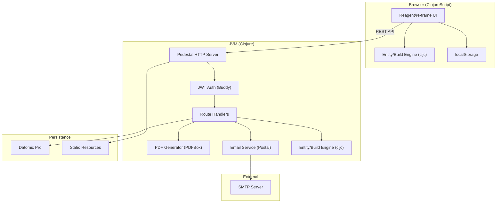
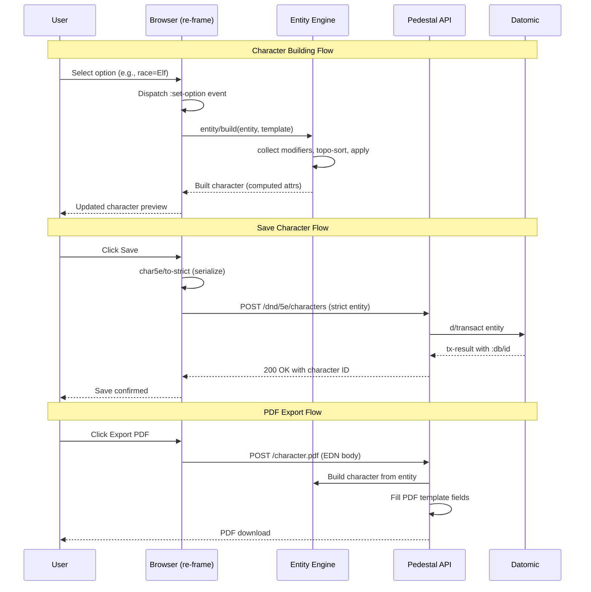

# System Architecture

## System Overview

A full-stack Clojure/ClojureScript single-page application (SPA) using a component-based backend (Pedestal + Datomic) and a reactive frontend (Reagent + re-frame). The core innovation is a shared entity/template/modifier engine that runs identically on JVM and browser.

## Architecture Diagram

## Component Descriptions

### Pedestal HTTP Server
- **Purpose**: HTTP request handling with interceptor chain
- **Responsibilities**: Request routing, middleware (CSP, ETag, GZIP), static file serving
- **Dependencies**: Jetty 11, Ring adapter, io.pedestal
- **Type**: Application

### Route Handlers (`orcpub.routes`)
- **Purpose**: Business logic for all HTTP endpoints
- **Responsibilities**: Character CRUD, user management, PDF generation, authentication
- **Dependencies**: Datomic, Buddy, PDF generator, Email
- **Type**: Application

### JWT Authentication (`orcpub.security`, Buddy)
- **Purpose**: Stateless authentication via signed tokens
- **Responsibilities**: Token creation/validation, rate limiting, password hashing
- **Dependencies**: buddy-auth, buddy-hashers
- **Type**: Application

### Entity/Build Engine (`orcpub.entity`, `orcpub.modifiers`)
- **Purpose**: Declarative character computation — the core domain engine
- **Responsibilities**: Template traversal, modifier collection, dependency resolution (Kahn's algorithm), attribute computation
- **Dependencies**: None (pure Clojure/Script)
- **Type**: Shared (cljc)

### PDF Generator (`orcpub.pdf`)
- **Purpose**: Generate printable character sheets
- **Responsibilities**: Fill PDF form fields, embed images, generate spell cards
- **Dependencies**: PDFBox 3.x, fillable PDF templates
- **Type**: Application (JVM only)

### Email Service (`orcpub.email`)
- **Purpose**: Transactional email delivery
- **Responsibilities**: Verification, password reset, error notifications
- **Dependencies**: Postal (SMTP client)
- **Type**: Application

### Reagent/re-frame UI
- **Purpose**: Reactive single-page application
- **Responsibilities**: Character builder UI, content browsers, auth forms
- **Dependencies**: React 18, Reagent 2.0, re-frame 1.4, bidi (routing)
- **Type**: Application (ClojureScript)

### Datomic Pro
- **Purpose**: Immutable database with entity semantics
- **Responsibilities**: User storage, character persistence, party/folder management
- **Dependencies**: Datomic Peer library
- **Type**: Infrastructure

## Data Flow

## Integration Points

### External APIs
- **SMTP Server**: Transactional email delivery (configurable via env vars)
- **Image URLs**: Character portrait/faction images loaded from user-provided URLs during PDF generation

### Databases
- **Datomic Pro** (dev transactor): Primary data store for users, characters, parties, folders, items. Uses entity/component model matching the application's entity architecture.

### Third-party Services
- **None in production**: Fully self-contained. Fork hooks exist for analytics/ads but are no-ops in the public repo.

## Infrastructure Components

### Docker Deployment
- **`datomic` container**: Datomic Pro transactor
- **`orcpub` container**: JVM application (Java 21, uberjar)
- **`web` container**: nginx reverse proxy with SSL termination

### Deployment Model
- Single-node Docker Compose stack
- Data persisted in `./data/` volume (Datomic storage)
- Logs in `./logs/` volume
- SSL certificates in `./deploy/` (self-signed or user-provided)
- Homebrew content loaded from `./deploy/homebrew/homebrew.orcbrew`
