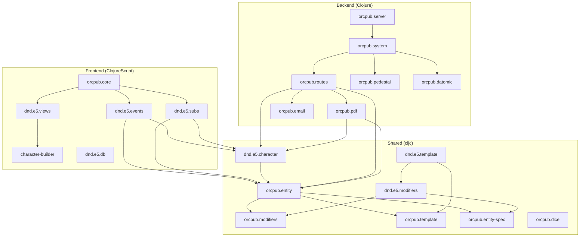

# Dependencies

## Internal Dependencies

## Key Internal Dependency Chains

### Entity Engine Chain
- `orcpub.entity` depends on `orcpub.modifiers` (apply-modifiers, modifier-fn)
- `orcpub.entity` depends on `orcpub.template` (selection/option specs)
- `orcpub.entity` depends on `orcpub.entity-spec` (macro system)
- `orcpub.modifiers` depends on `orcpub.entity-spec` (modifier creation)

### D&D Domain Chain
- `orcpub.dnd.e5.template` depends on `orcpub.dnd.e5.modifiers` (modifier factories)
- `orcpub.dnd.e5.modifiers` depends on `orcpub.modifiers` (base modifier system)
- `orcpub.dnd.e5.character` depends on `orcpub.entity` (build engine)
- Content files (`races`, `classes`, `spells`, etc.) depend on `dnd.e5.modifiers`

### Frontend Chain
- `orcpub.dnd.e5.events` depends on `orcpub.entity` (entity manipulation)
- `orcpub.dnd.e5.subs` depends on `orcpub.entity` (entity/build for `:built-character`)
- `orcpub.character-builder` depends on `subs` + `events` + template domain

### Backend Chain
- `orcpub.routes` depends on `orcpub.entity.strict` (serialization)
- `orcpub.routes` depends on `orcpub.pdf` (PDF generation)
- `orcpub.pdf` depends on `orcpub.dnd.e5.character` (character accessors)
- `orcpub.system` depends on `orcpub.{datomic,pedestal,routes,config}`

## External Dependencies

### Core Runtime
| Dependency | Version | Purpose | License |
|-----------|---------|---------|---------|
| org.clojure/clojure | 1.12.4 | Language runtime | EPL-1.0 |
| org.clojure/clojurescript | 1.12.134 | JS compilation | EPL-1.0 |
| com.datomic/peer | 1.0.7482 | Database client | Apache-2.0 |
| io.pedestal/pedestal.* | 0.7.0 | HTTP framework | EPL-1.0 |

### Frontend
| Dependency | Version | Purpose | License |
|-----------|---------|---------|---------|
| reagent | 2.0.1 | React wrapper | MIT |
| re-frame | 1.4.4 | State management | MIT |
| cljsjs/react | 18.3.1-1 | React core | MIT |
| cljsjs/react-dom | 18.3.1-1 | React DOM | MIT |
| bidi | 2.1.6 | Routing | EPL-1.0 |
| cljs-http | 0.1.49 | HTTP client | EPL-1.0 |
| com.cognitect/transit-cljs | 0.8.280 | Data encoding | Apache-2.0 |

### Security
| Dependency | Version | Purpose | License |
|-----------|---------|---------|---------|
| buddy/buddy-auth | 3.0.323 | JWT auth | Apache-2.0 |
| buddy/buddy-hashers | 2.0.167 | Password hashing | Apache-2.0 |

### Utilities
| Dependency | Version | Purpose | License |
|-----------|---------|---------|---------|
| org.apache.pdfbox/pdfbox | 3.0.6 | PDF manipulation | Apache-2.0 |
| com.draines/postal | 2.0.5 | SMTP email | MIT |
| hiccup | 2.0.0 | HTML templating | EPL-1.0 |
| environ | 1.2.0 | Env var access | EPL-1.0 |
| clj-http | 3.13.1 | HTTP client | MIT |
| funcool/cuerdas | 2026.415 | String utils | BSD-2 |
| camel-snake-kebab | 0.4.0 | Case conversion | EPL-1.0 |

### All dependencies are EPL-2.0 compatible (EPL-1.0, MIT, Apache-2.0, BSD).
