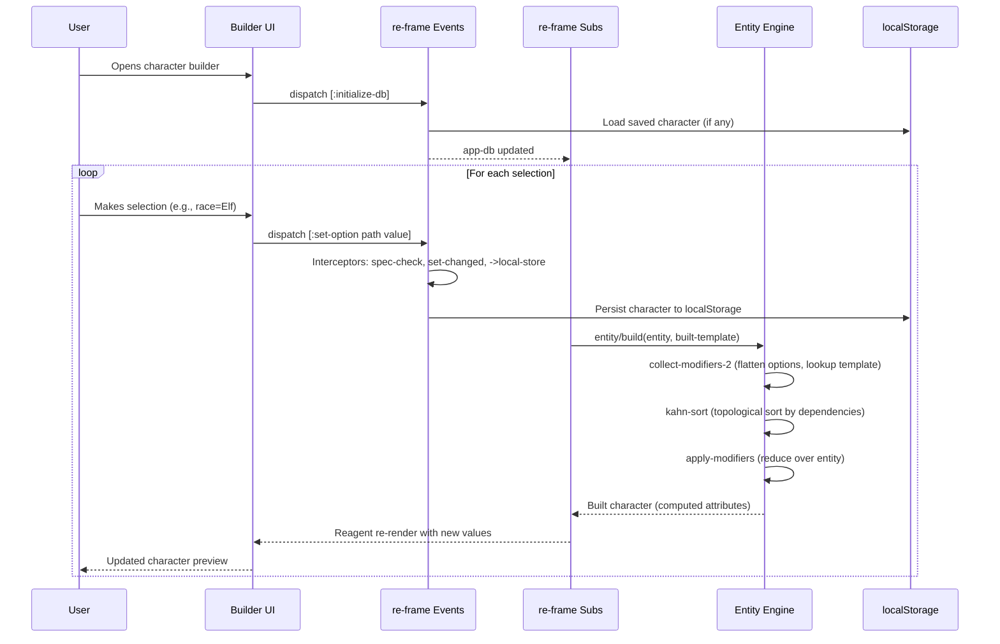
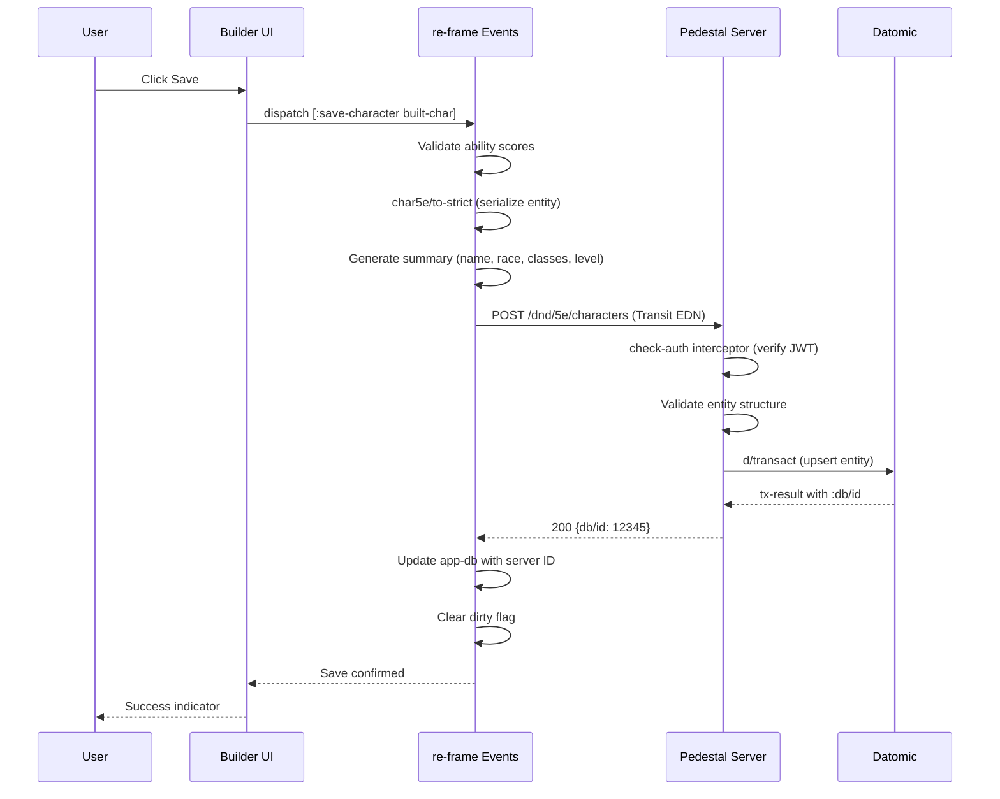
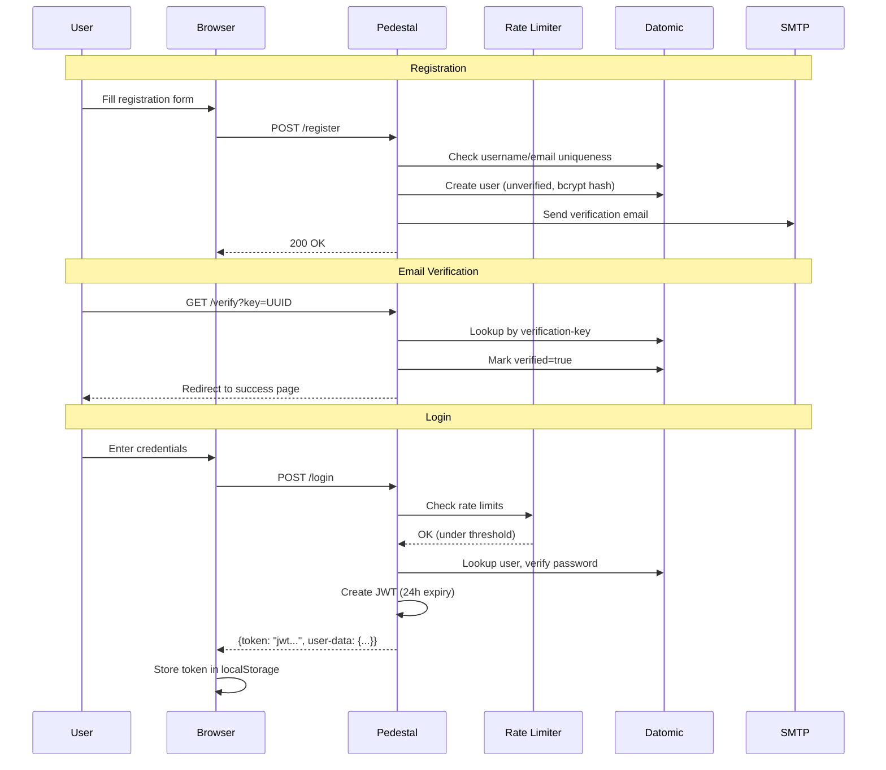
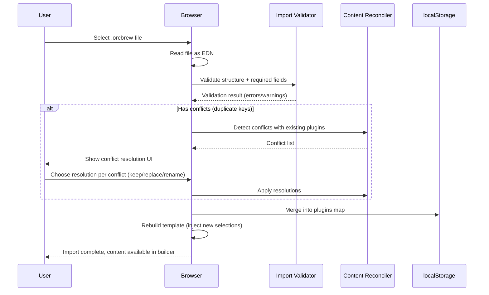
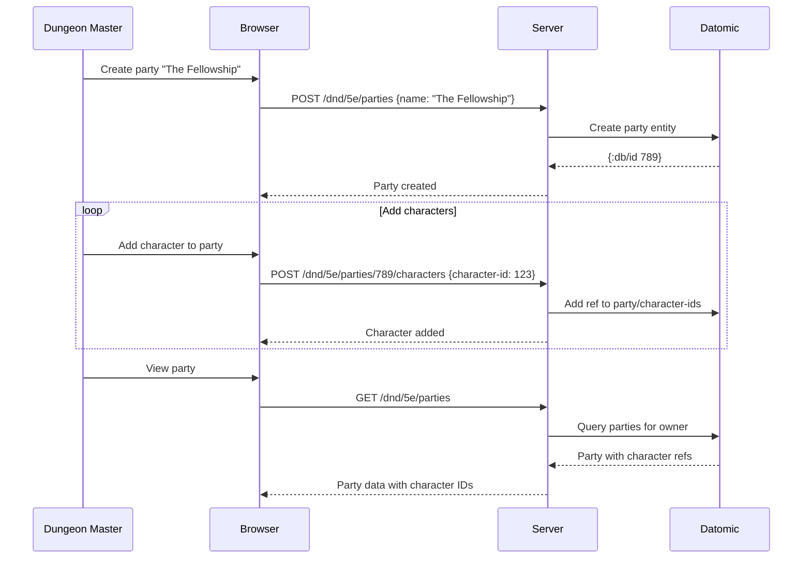

# Interaction Diagrams

## Business Transaction Flows

### 1. Character Creation (Build Flow)



### 2. Character Save (Persistence Flow)



### 3. PDF Export

```mermaid
sequenceDiagram
    participant User
    participant UI as Browser
    participant Server as Pedestal
    participant PDF as PDFBox
    participant FS as PDF Templates

    User->>UI: Click Export PDF
    UI->>UI: Build hidden form with EDN body
    UI->>Server: POST /character.pdf (form submit)
    Server->>Server: Parse EDN from form params
    Server->>Server: Determine template (spell count based)
    Server->>FS: Load fillable PDF template
    Server->>PDF: Open PDDocument
    Server->>PDF: write-fields! (fill all form fields)
    
    opt Has character image
        Server->>PDF: draw-image! (embed portrait)
    end
    
    opt Has spells
        Server->>PDF: print-spells (generate spell cards, 9/page)
    end
    
    PDF-->>Server: Completed PDF bytes
    Server-->>UI: Content-Disposition: attachment; filename=CharName.pdf
    UI-->>User: PDF download
```

### 4. User Authentication



### 5. Homebrew Import



### 6. Party Management


